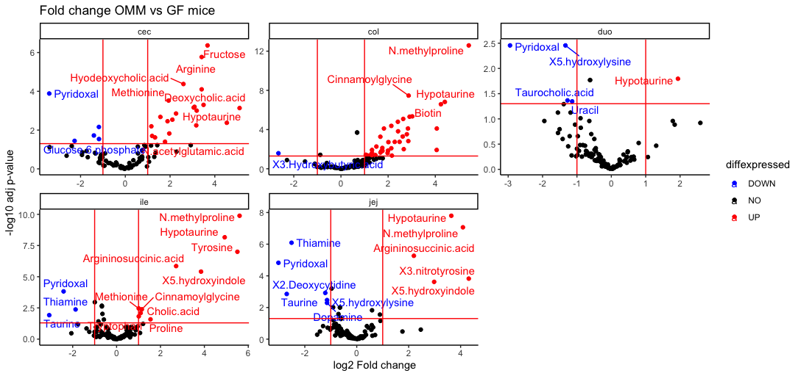

# Integration of metabolomics data and 16S data

This repository encompasses the analysis of a publicly available dataset collecting 16S data and metabolites along the gastrointestinal tract of mice [Meier et al., *Nature Metabolism*, 2023](https://www.nature.com/articles/s42255-023-00802-1). Here, we specifically correlate co-occurrence of OMM12 colonized mice with the metabolites found in the same locations and compare it to the metabolites found in germ-free (GF) mice.

Package dependencies can be found [here](R/gutPackages.R) and thank you to the authors of these!

Some of the functions include:

1. data cleanup for metadata integration
2. calculation of fold-changes between OMM12 and GF mice at the different locations
3. correlation heatmap for metabolite-microbe co-occurrences

## Data cleanup for metadata integration

Dataframes for both metabolite measurements and 16S abundance measurements are imported and matched with the respective metadata. 

[Metabolites](examples/intdata_all.csv)

[Microbes](examples/rarefied_OTU_table_RA_Family.xlsx)

Metabolites were sampled along the gut featuring 15 sample sites, whereas 16S data is sampled from five distinct sites (duodenum, jejunum, ileum, cecum and colon) along the gut. Metabolomic data is recoded to the microbial sample sites and averaged over those.

Both tables are merged with the metadata and transformed into the long format for further processing.

## Calculation of fold-changes between OMM12 and GF mice at different locations

In order to determine bacterially derived metabolites from dietary metabolites, we compared metabolites between OMM12 and GF mice at each respective location. First we determined normalcy of the data, then we log-transformed the data to conform normality. We calculated log2 fold changes for each metabolite at each site and performed a unpaired ttest with Bonferroni-Hoechberg correction for multiple testing. 

## Correlation calculation for metabolite-microbe co-occurrences

Transforming the long-formats of metabolites and microbes respectively, we create the wide-formats used for input into the correlation loop. Here we use the mean of each metabolite and microbe at each sampling site, and the loop correlates each bacteria with each metabolite at each sampling site separately. 

The resulting correlation df is then transformed into long format before joining with the corresponding p-values. 

From the previous section, we filter out metabolites that are specifically found in GF mice as they are likely of dietary/host origin. To generate an overview of metabolite-microbe correlation pairs we generate the following histogram:

We further filter the correlations based on p-value <0.05 and a log2 fold-change above 0.76 and generate the corresponding heatmap with metabolites as rownames and microbes as columnnames in order to generate a overview of metabolite-microbe co-occurrences:

