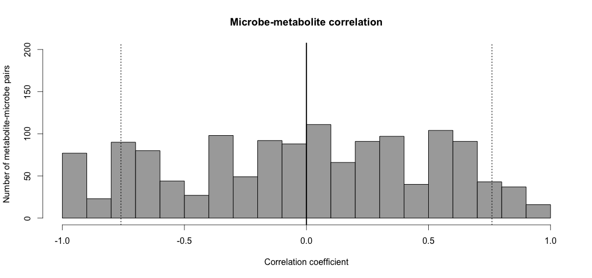
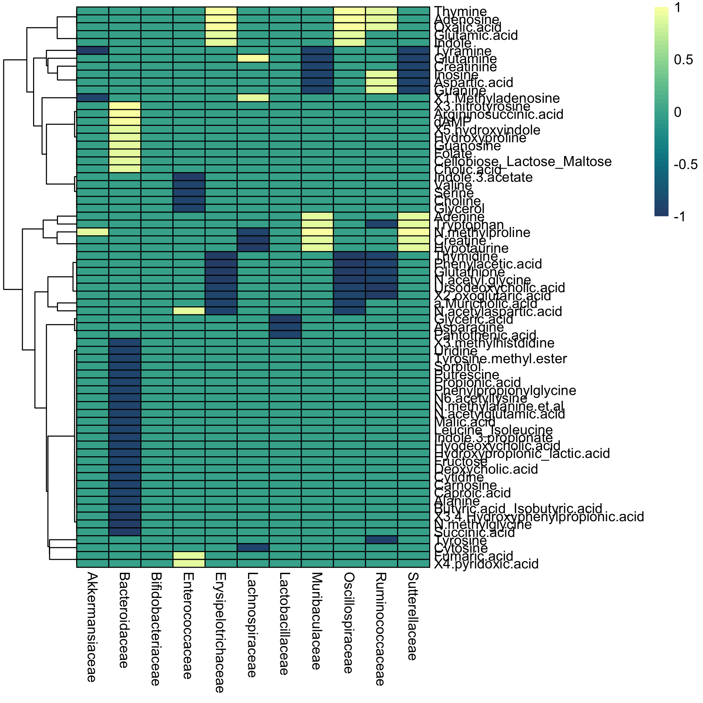

# Integration of metabolomics data and 16S data

This repository encompasses the analysis of a publicly available dataset collecting 16S data and metabolites along the gastrointestinal tract of SPF and GF mice [Meier et al., *Nature Metabolism*, 2023](https://www.nature.com/articles/s42255-023-00802-1). Here, we specifically correlate co-occurrence of OMM12 colonized mice with the metabolites found in the same locations and compare it to the metabolites found in germ-free mice.

Package dependencies can be found [here](R/gutPackages.R) and thank you to the authors of these!

Some of the functions include:

1. data cleanup for metadata integration
2. calculation of fold-changes between OMM12 and GF mice at the different locations
3. correlation heatmap for metabolite-microbe co-occurrences

